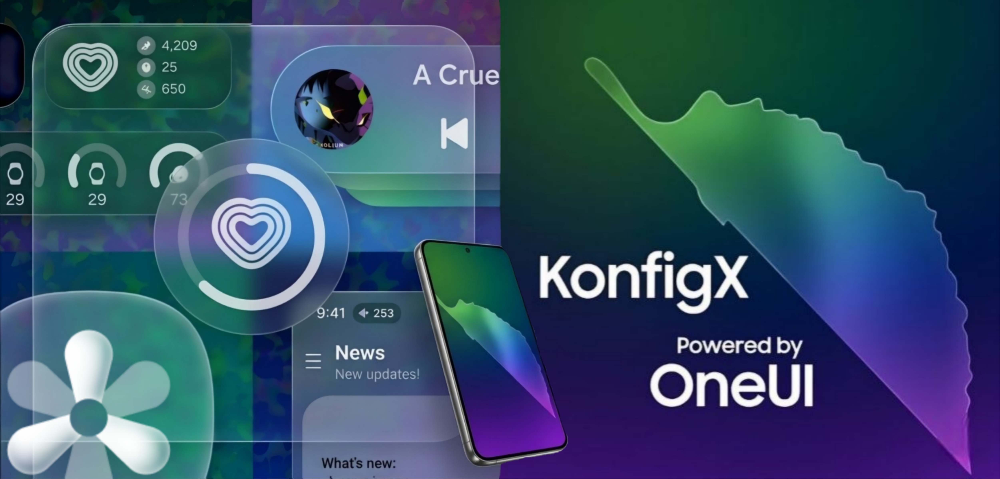

<h1 align="center">
  
</h1>

KonfigX is a next-generation custom firmware for Samsung Galaxy devices.

 Our Telegram 
(https://t.me/KonfigXROMTalk)

---

# KonfigX

> Refined • Optimized • Powerful One UI Experience

---

##  What is KonfigX?

KonfigX is a work-in-progress custom firmware designed to deliver a clean, fast, and feature-rich One UI experience.

Ported from the latest, and greatest S24 FE One UI 8.0 Firmware. (subject to change)

The build system downloads firmware components, applies patches, and produces a flashable ZIP for supported devices.

---

##  Features

###  Core System

* Based on the latest Galaxy S24 FE One UI 8.0 firmware (subject to change)
* EROFS filesystem
* Debloated system
* Optimized performance & smoothness

###  UI & Experience

* High-end animations
* Native / Live blur support
* Adaptive color tone
* Adaptive refresh rate
* AOD clock transitions

###  Galaxy AI Integration

* Audio eraser
* Browsing assist
* Call assist
* Drawing assist
* Interpreter
* Note assist
* Photo assist
* Semantic search
* Writing assist
* Transcript assist

###  Media & Camera

* Object / shadow / reflection eraser
* Image clipper
* Picture remaster

###  System & Privacy

* Camera privacy toggle
* Hide developer options
* Screenshot detection toggle

###  Extra Features

* Samsung DeX support
* Multi-user support
* Dual Messenger for all apps
* Auto PIN confirm
* Extra brightness
* Outdoor mode

###  Tweaks

* App downgrade support
* Old targetSdk install support (similar to --bypass-low-target-sdk-block)
* Play Integrity Fix
* Key attestation spoofing
* Unlimited Google Photos backup

---

##  Build System

KonfigX includes a build system that:

* Downloads required firmware
* Extracts and patches system components
* Integrates custom features
* Outputs a flashable ZIP

---

##  Licensing

Licensed under GNU GPL v3.0.

External tools may use different licenses:

* android-tools (Apache 2.0)
* apktool (Apache 2.0)
* erofs-utils (GPL-2.0 / Apache-2.0)
* img2sdat (MIT)
* Android platform build tools (Apache 2.0)
* smali (multiple licences)
---

##  Credits

Special thanks to all projects and developers that inspired or contributed to KonfigX:

### Projects

* UN1CA (for features, patches, and the build system)
* LemonUI (for build.prop tweaks)
* NightOS (for debloat list and the inspiration for KonfigX)
* H33CKER (for tweaks)
* MonsterROM (for tweaks)
* Loftenth (for bug fixes)
* Haip4eva (for tweaks)
* ExtremeROM (for tweaks, platform, and target for exynos2100)
* LumiROM (for tweaks and idea of ROM)

### Contributors

- **[K0nf1gur@r3 Ph0n3s](https://github.com/KonfigurarePhones)** (Owner)
- **[DaniTheSillyFem](https://github.com/DaniTheSillyFem)** (Co-Owner??? + a34x)
- **[YACINEGTI](https://github.com/Yacinegti-DZ)** (o1s + helper)
- **[3k5i](https://github.com/samsungs215Ghype)** (o1s + helper)
- **[gඞbi](https://github.com/gyabii)** (dm1q)
- **[idkqwertyuiopasdf](https://github.com/idkqwertyuiopasdf)** 
* tzerx (tester)
* Harvey (Galaxy A15 support, coding team)

-------------------------------------------------------------------------------

##  Help

There is some ways to help our project!

*  Contribute by forking the repo, and opening a pull request
*  Starring the repo
